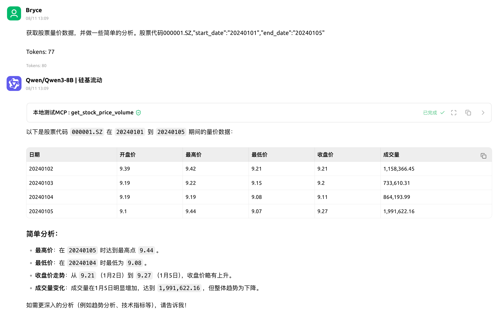

# 📈 StockAgent - 企业级 AI 金融分析工具集

**StockAgent** 是一个专为大语言模型（LLM）打造的、功能全面的金融分析工具集。它通过提供一系列即插即用的 API，将强大的 AI 代理（Agent）与实时、准确的金融数据和复杂的分析模型连接起来，实现了从自然语言到深度金融洞察的无缝转换。

## 🌟 核心特点

-   **全链路覆盖**: 工具集涵盖从**数据获取**、**技术分析**、**基本面查询**到**信息检索**的全部分析链路，为构建复杂的金融工作流提供了坚实基础。
-   **自然语言驱动**: 专为对话式交互设计。AI 代理能够智能地解析用户意图，并在 20 个工具中自主选择、组合使用，以完成任务。
-   **实时与准确**: 所有数据均通过 [Tushare Pro](https://tushare.pro/) 接口实时获取，保证了信息的时效性和准确性。
-   **为 AI Agent 深度优化**: 所有工具的接口（输入/输出）都经过精心设计，遵循严格的、可被 JSON 序列化的数据结构，确保与主流 LLM 框架和 AI 开发平台（如 Cherry Studio）完美兼容。
-   **高度可扩展**: 基于 `mcp-server` 构建，模块化的代码结构使得添加新的金融数据源或自定义分析工具变得异常简单。

## 📸 功能演示

下图展示了 StockAgent 在 AI 应用平台中的一个典型工作流程：用户通过自然语言提出一个多步骤的分析需求，Agent 能够自主规划，并依次调用 `search_stock_code`、`get_stock_price_volume` 和 `calculate_technical_indicators` 工具，最终形成完整的分析报告。

---

## 🛠️ 全功能工具集一览

StockAgent 提供了 20 个精心设计的工具，分为以下几大类：

### 1. 市场行情与数据获取

| 工具名称 | 功能描述 |
| :--- | :--- |
| **`get_stock_price_volume`** | 获取指定股票在日期范围内的量价历史数据。 |
| **`get_index_price`** | 获取大盘指数（如上证指数）的行情数据。 |
| **`get_latest_trade_date`** | 获取A股市场最近的一个交易日。 |

### 2. 技术分析与计算

| 工具名称 | 功能描述 |
| :--- | :--- |
| **`calculate_technical_indicators`** | 计算常用技术指标（MA, RSI, MACD）。 |
| **`calculate_bollinger_bands`** | 计算布林带（BOLL）指标。 |
| **`calculate_period_return`** | 计算给定数据区间的累计涨跌幅。 |
| **`calculate_data_summary`** | 对数据列进行基础统计分析（均值、标准差等）。 |
| **`find_price_breakthrough`** | 在价格数据中查找向上或向下突破指定价格水平的日期。 |
| **`get_candlestick_pattern`** | 简单识别日K线的基本形态（阳线、阴线、十字星）。 |

### 3. 公司基本面与财务

| 工具名称 | 功能描述 |
| :--- | :--- |
| **`get_stock_basic_info`** | 获取单个股票的基本信息（名称、行业、上市日期等）。 |
| **`get_financial_indicators`** | 获取公司指定报告期的主要财务指标（PE, PB, EPS等）。 |
| **`get_top10_shareholders`** | 查询公司指定报告期的前十大股东信息。 |
| **`check_if_st_stock`** | 检查一只股票当前是否为ST或*ST股。 |

### 4. 信息检索与筛选

| 工具名称 | 功能描述 |
| :--- | :--- |
| **`search_stock_code`** | 根据关键词（公司名称或代码）模糊搜索匹配的股票列表。 |
| **`get_stocks_by_industry`** | 获取指定行业分类下的所有股票列表。 |
| **`get_company_news`** | 查询上市公司在指定日期范围内的公告。 |
| **`filter_high_dividend_stocks`** | 筛选出股息率高于某个阈值的股票列表。 |

### 5. 特色与持股数据

| 工具名称 | 功能描述 |
| :--- | :--- |
| **`get_top_list_data`** | 获取指定交易日的龙虎榜机构明细数据。 |
| **`get_hk_hold_data`** | 获取沪深港通对某只A股的持股明细。 |
| **`compare_two_stocks_price`** | 比较两只股票在指定日期的收盘价。 |

---

## 💡 复杂工作流示例 (Workflow Examples)

StockAgent 的真正威力在于其组合能力。Agent 可以将上述工具链接起来，完成复杂的分析任务：

-   **市场扫描与深度分析**:
    > "帮我筛选出白酒行业中，当前市盈率低于30，并且最近一个月RSI指标低于40的股票。"
    -   **Agent 路径**: `get_stocks_by_industry` -> (循环) `get_financial_indicators` -> (过滤) `get_stock_price_volume` -> (过滤) `calculate_technical_indicators` -> (过滤) -> **最终报告**

-   **事件驱动分析**:
    > "查询一下贵州茅台最近发布了什么公告，并分析公告发布后五天的股价走势和技术指标变化。"
    -   **Agent 路径**: `get_company_news` -> (获取公告日期) `get_stock_price_volume` -> `calculate_period_return` + `calculate_technical_indicators` -> **综合回答**

## 📜 许可证

本项目采用 [MIT License](LICENSE) 开源。